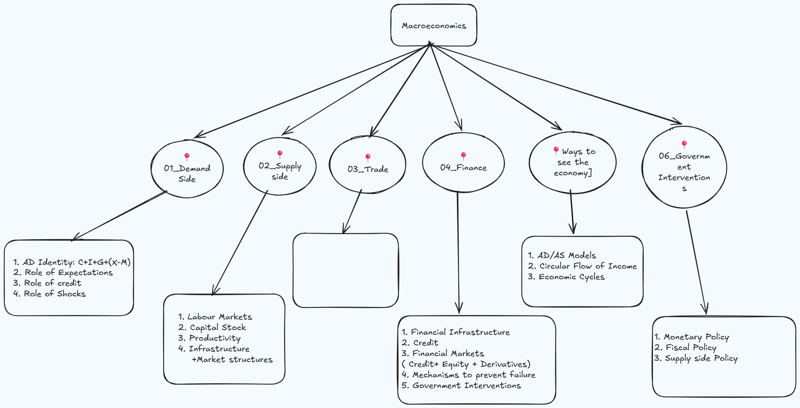

### Purpose
--- 
I’ve always been drawn to the “-ics” disciplines -  economics, politics, analytics -  and this repository is my way of bringing that curiosity together in one structured place. This section focuses on macroeconomics: how the economy works at a system-wide level and how I personally understand its moving parts. It’s a growing collection of concepts, diagrams, and explanations that I’m building for clarity, reference, and long-term learning.
### An overview of Macroeconomics:
--- 

### Topic Links 
--- 
- [Demand Side](Topics/Demand_Side.md)
- [Supply Side](Topics/Supply_Side.md)
- [Finance & Credit](Topics/Finance.md)
- [Trade & Open Economy](Topics/Trade.md)
- [Government Policy](Topics/Policy.md)
- [Ways of Seeing the Economy](Topics/Ways_of_Seeing.md)
### Repository Structure
---
- **Topics/** — Detailed notes on each macro area  
- **Excalidraw/** — Editable diagrams and conceptual maps  
- **Images/** — Exported PNG/SVG files used in the README  

